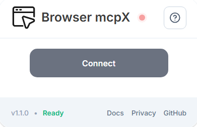

## Install the extension

Install the [**Browser MCPX extension**](https://chromewebstore.google.com/detail/fjbloajdmlfghkejmkgboceindianlge?utm_source=item-share-cb) from the Chrome Web Store (or your browser’s extension marketplace).

---

## Pin the extension

For easy access, pin the Browser MCPX extension to your browser toolbar:

1. Open the extensions menu in your browser.  
2. Locate **Browser MCPX**.  
3. Click the pin icon to keep it visible in the toolbar.  

---

## Connect the extension

1. Click the **Browser MCPX** icon in the toolbar.  
2. Select **Connect** to link the current browser tab to the MCP server.  

Once connected, all browser actions will run on the active tab.

---

## Next step

Continue with [**Start automating**](/docs/start-automating) to trigger actions and automate workflows using Browser MCPX.  

---

📬 Questions? Contact us at **[contact@mcpx.tech](mailto:contact@mcpx.tech)**.
